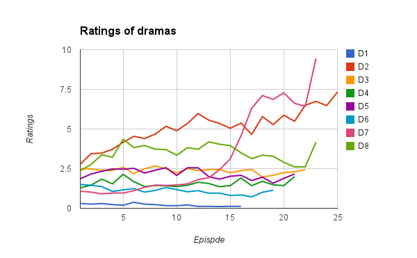
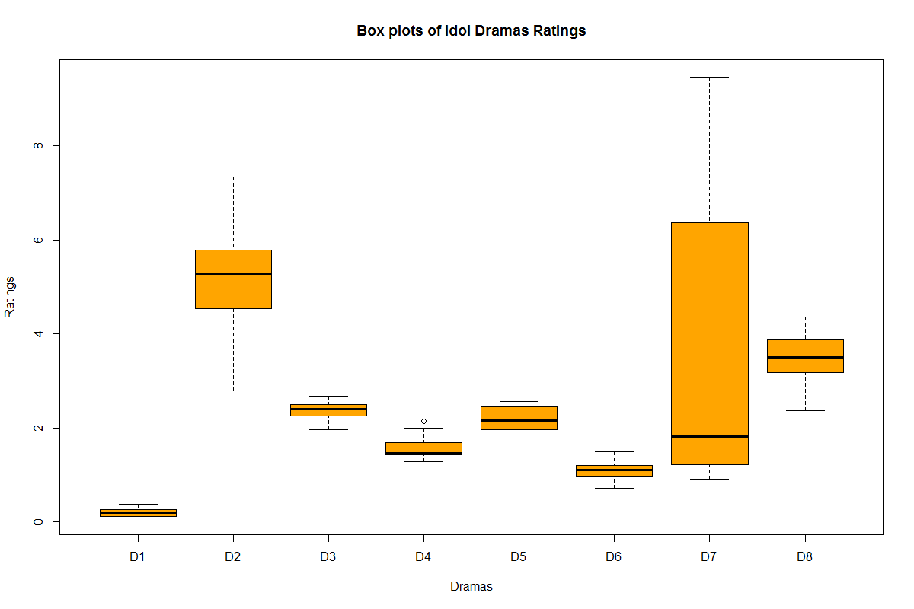

---
author:
- Student — Ting-Wei Ku (Martin) \newline\newline
- Advisor — Prof. Shou-De Lin \newline\newline
- Committee — Prof. Pu-Jen Cheng, Ph.D. Cheng-Te Li
title: TV Ratings Prediction with \newline Time Weighting Based Regression (TWR)
subtitle: Master Thesis Defense
date: Feb 2, 2015
institute: National Taiwan University \newline Department of Computer Science & Information Engineering \newline Machine Discovery & Social Network Mining Lab
...

# Thesis Goal: Improve TV Ratings Prediction with MY NOVELTY

## Why TV ratings prediction?
It is an important, complex, and real-world problem with money.

- It's important because TV ratings decide **price of advertising time**.
- It's complex because...
    - TV ratings are **aggregate** measure of **many people's choices**.
    - TV is **competing** with many platforms/services (mobile/YouTube).

\note{
Story-perspective reason:
I've let Prof.Shou-De know that I want to solve real-world problem.
I was working a problem on Kaggle as my research: Online Product Sales.
One day, III asked Prof.Shou-De to help improve TV ratings prediction for SET.
So, Prof.Shou-De assigned III's request to me.
}

## MY NOVELTY (Contribution) is TWR
- **Key idea**: Fit regression model with time-weighted instances.
- **Example**: Given x is a time series of ratings,
    - (x1, x2, x3, x4=y4), t=4, weight=4
    - (x2, x3, x4, x5=y5), t=5, weight=5
    - (x3, x4, x5, x6=y6), t=6, weight=6
    - ...more weighted training instances
    - (x6, x7, x8, x9=y9), t=9, testing instance
- **Assumption**: Intuitively, newer instances are more important.

We'll show how **effective** this **simple** solution is.

# Related Work

## TV Ratings Prediction

\note{
We can add speaker note here.
}

# Solution: Time Weighting Based Regression (TWR)

## What is TWR?

## Why TWR?

## How does TWR work?

# Experiments

## What TV ratings to predict?
- **Data**: 8 real-world weekly dramas (170 ratings) broadcast in TW
    - Originally from SET but now also available at Wikipedia
- Predict next ratings of each drama (1-step forecasting)
- Start making predictions from the 6th episode

\note{
Why only 8 dramas?
Why weekly dramas?
Why start from the 6th episode?
}

## Time Series Plot of Data


## Box Plot of Data


## Basic Info of Data
Drama | # Episode | Start | Avg(ratings) | Std(ratings)
----- | --------- | ----- | ------------ | ------------
D1 | 16 | 2013/2/28 | 0.21 | 0.08
D2 | 25 | 2011/8/21 | 5.12 | 1.09
D3 | 22 | 2012/2/19 | 2.38 | 0.16
D4 | 21 | 2013/1/6 | 1.57 | 0.23
D5 | 21 | 2013/6/9 | 2.16 | 0.3
D6 | 19 | 2010/12/5 | 1.1 | 0.21
D7 | 23 | 2010/11/5 | 3.36 | 2.75
D8 | 23 | 2012/7/22 | 3.47 | 0.56

# Conclusion

## Code example

``` {.r}
if (weight_type == 'equal') {
  # this is known as bagging
  case_weights <- rep(1 / num_cases, num_cases)
} else if (weight_type == 'linear') {
  case_weights <- seq(1, num_cases)
} else if (weight_type == 'exp') {
  case_weights <- exp(1:num_cases)
} else if (weight_type == 'exp3') {
  alpha <- 3
  case_weights <- (exp(1)^alpha)^(1:num_cases)
} else {
  # decide weight type automatically via validation error  
}
```

---
\begin{center}
  \Large{Thank you! Any question?}
\end{center}
